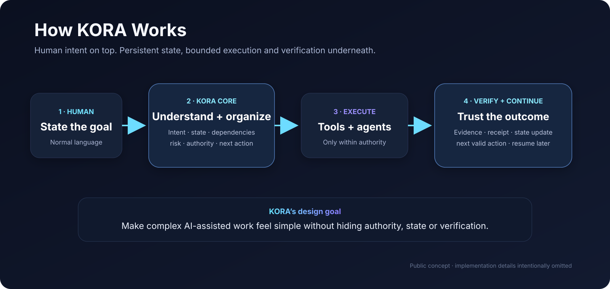
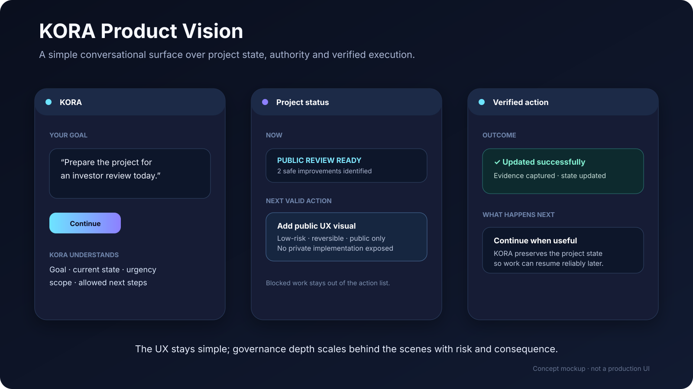

# KORA

> **A human-directed operating layer for reliable AI-assisted work.**

**Status:** pre-product / prototype-stage  
**Public repository:** project overview, architecture, status, collaboration and diligence surface  
**Private development:** implementation, internal governance evidence and security-sensitive details remain private

KORA explores a simple idea: **a person should be able to state a goal in normal language while the system keeps the work organized, chooses the next valid action, coordinates tools or AI agents, verifies important outcomes and preserves enough project state to continue reliably later.**

## The problem

AI systems are becoming more capable, but serious multi-step work still leaves the user carrying much of the operational burden:

- remembering project context across sessions;
- deciding which tool or agent should act next;
- tracking dependencies and blocked work;
- deciding when human approval is required;
- checking whether an action actually succeeded;
- recovering safely after failures;
- preventing parallel work from corrupting canonical state.

KORA is an attempt to close the gap between **AI capability** and **reliable AI operations** without removing human authority.

## The KORA hypothesis

A useful operating layer for AI-assisted work should combine:

1. **Natural-language control** — intent first, not memorized commands.
2. **Persistent project state** — done, active, blocked, next and why.
3. **Task and dependency awareness** — work happens in a valid order.
4. **Risk-proportional authority** — lightweight for low-risk work, stronger checks for consequential work.
5. **Tool and agent orchestration** — route work to the right capability.
6. **Verification before trust** — important outcomes produce evidence, not only confident text.
7. **Recovery-aware execution** — reversible work, checkpoints and explicit failure handling.
8. **Human authority** — goals, scope and consequential approvals remain human-directed.

## What exists today

KORA is **not a finished autonomous assistant**. It is an early systems project moving from governance/prototyping toward an executable core.

Work already implemented or substantially exercised in private development includes:

- a versioned governance and human-authority model;
- controlled execution and fail-closed workflow concepts;
- review, verification and evidence workflows;
- transaction-style request → authorization → execution → verification → state-update semantics;
- natural-language continuation concepts;
- safe-parallelism rules for independent, reversible work;
- a **bounded local execution bridge prototype** that has been implemented and exercised through staged local testing;
- public architecture, status and collaboration documentation.

These are **prototype/research engineering results**, not claims of production readiness.

For the current milestone state, see **[Project Status & Roadmap](docs/STATUS_AND_ROADMAP.md)**.

## High-level flow

```text
Human goal
   ↓
Intent + persistent project state
   ↓
Plan + dependencies + risk/authority
   ↓
Tool / agent orchestration
   ↓
Execution
   ↓
Verification / evidence
   ↓
State update + next valid action
```

### Product at a glance



This is intentionally a **public concept view**: it explains the product logic without exposing private implementation, exact approval boundaries or security-sensitive details.

A more detailed, deliberately non-sensitive view is in **[High-Level Architecture](docs/ARCHITECTURE.md)**.

## What KORA is not

KORA is not currently:

- a foundation model;
- a replacement for human decision-making;
- a production-ready autonomous agent platform;
- a claim that every AI action should be automated;
- an open publication of the private implementation or security model;
- a validated product-market-fit claim.

The near-term question is narrower and testable:

> **Can KORA make a real multi-step AI-assisted project materially more reliable and lower-friction than an assistant plus manual tool management?**

## Current focus

The next major target is a **minimal KORA Core** that can demonstrate one complete loop:

```text
GOAL → PLAN → AUTHORIZED ACTION → EXECUTION → VERIFICATION → PERSISTENT CONTINUATION
```

The first meaningful milestone is not “more architecture.” It is a small end-to-end core used on a real project with measurable outcomes.

### Product experience concept



The intended experience is deliberately simple: **state the goal, see the current project state and next valid action, approve only when needed, and receive a verified outcome that can be continued later.** Governance depth should scale behind the scenes with risk and consequence rather than becoming permanent user-facing friction.

## Public / private boundary

This repository is intentionally the **public collaboration and diligence surface**, not the canonical private engineering repository.

Public here:

- project thesis and problem definition;
- high-level architecture;
- current stage and roadmap;
- collaboration needs;
- investor / partner brief;
- contribution and security guidance.

Private by design:

- canonical governance rule registers;
- internal execution scripts and implementation details;
- exact approval/security boundaries;
- credentials and machine-specific configuration;
- detailed evidence chains, hashes and operational artifacts;
- unpublished IP-sensitive material.

See **[NOTICE](NOTICE.md)**.

## Explore the project

- **[Status & Roadmap](docs/STATUS_AND_ROADMAP.md)** — where the project actually stands.
- **[Architecture](docs/ARCHITECTURE.md)** — public system model and trust boundaries.
- **[Design Principles](docs/DESIGN_PRINCIPLES.md)** — rules KORA is being designed around.
- **[FAQ](docs/FAQ.md)** — direct answers to common technical and diligence questions.
- **[Collaborate](COLLABORATE.md)** — technical co-founder and contributor paths.
- **[Investor / Partner Brief](INVESTORS_AND_PARTNERS.md)** — current thesis, stage and capital use.
- **[Contributing](CONTRIBUTING.md)** — what is useful to contribute to this public surface.
- **[Security](SECURITY.md)** — responsible disclosure guidance.

## Who we are looking for

Highest priority:

- a **technical co-founder / lead engineer** with strong backend/systems judgment;
- AI/backend engineers interested in orchestration, durable state and evaluations;
- reliability/security collaborators interested in permissions, sandboxing and recovery;
- product/UX collaborators focused on making complex AI operations feel simple;
- mentors, pilot partners and pre-seed investors who understand that this is still an evidence-building stage.

## Founder

**Miha Tavčar — Ljubljana, Slovenia**  
GitHub: `@vcheeko`  
LinkedIn: `miha-tavcar-773502101`

Miha's role is product vision, systems thinking, workflow/governance design, AI-assisted prototyping, testing and project direction. He is **not presented as a senior software engineer**; KORA is intentionally seeking stronger software-engineering leadership around the project.

---

**KORA is early. The ambition is large; the current claims are intentionally narrow. Evidence comes before scale.**
